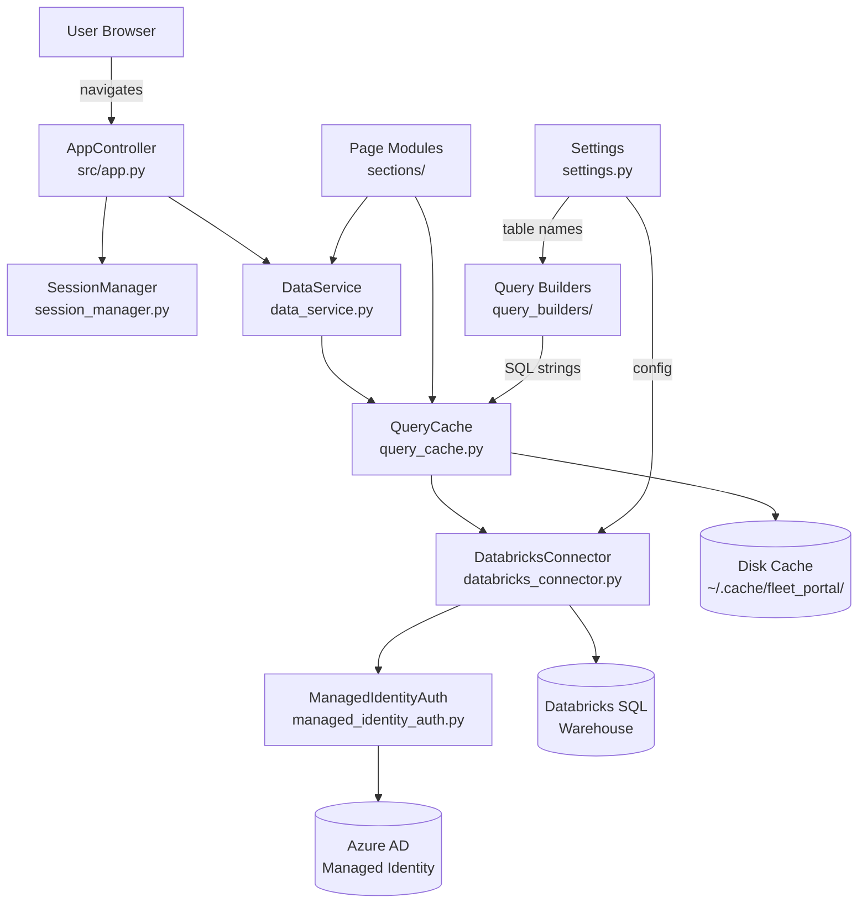
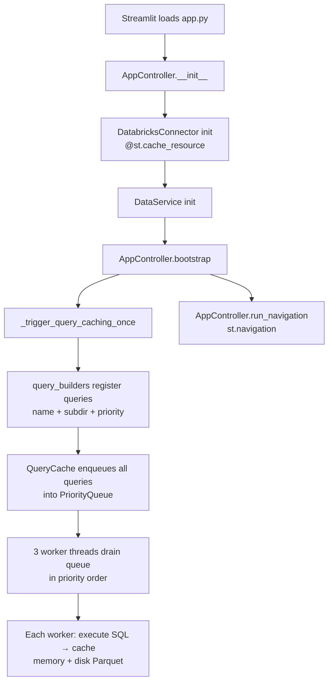
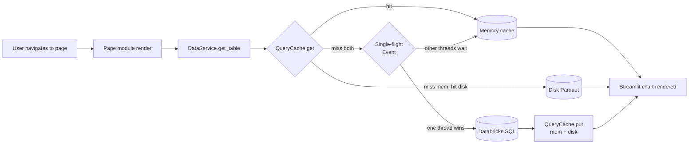

# Skill: Codebase Explainer and Architecture Mapper — Fleet Analytics Portal

## Purpose

Use this skill when asked to inspect this repository and explain:

* What the Fleet Analytics Portal does
* How its layers interact (Streamlit frontend, backend services, Databricks, Azure)
* What the main execution flows look like (app startup, page navigation, data loading, caching)
* What the data flow looks like (Databricks SQL → QueryCache → DataService → page components)
* Which files and modules are most important
* How to understand the backend in depth (connector, auth, cache, query builders)
* How to understand the system under the hood using diagrams

The repository implements the **Fleet Analytics Portal**: a Streamlit web dashboard for monitoring Volvo vehicle health, fleet statistics, hardening KPIs, and ad-hoc analytics. It connects to Databricks SQL warehouses using Azure Managed Identity, pre-warms SQL results into a two-level memory+disk cache, and renders interactive analytics pages.

The goal is to help a developer quickly understand this specific codebase.

---

## Core Behavior

When analyzing this repository, do **not** jump straight into individual files. First build a mental map of the whole system.

Work in this order:

1. Identify which subsystem the question relates to (app startup, page/section, backend service, cache, query builder, or deployment).
2. Find the relevant entry points for that subsystem.
3. Identify the modules and layers involved.
4. Trace the flow from trigger (user navigates to page, cache warms, refresh button) to final output.
5. Trace the data flow (Databricks SQL → QueryCache → DataService → page component → Streamlit chart).
6. Summarize the architecture of the subsystem and how it connects to the rest.
7. Draw flow diagrams.
8. Highlight important files, patterns, risks, and extension points.

Do not modify code unless explicitly asked.

---

## Repository Inspection Checklist

Start by looking for these files and directories:

### Project metadata

Look for:

* `README.md`
* `pyproject.toml` — Python dependencies, project metadata
* `Makefile` — dev commands (lint, test, run)
* `databricks.yml` — Databricks Asset Bundle config (job/cluster definitions)
* `deployment/Dockerfile.fleet-portal` — Container image for deployment
* `src/common/settings.py` — **All configuration**: Databricks hostname, HTTP path, all Unity Catalog table names, HKPI windows, blacklist tables, Azure AD app ID
* `.env` (local dev) or environment variables — secrets: `DATABRICKS_SERVER_HOSTNAME`, `DATABRICKS_HTTP_PATH`, `DATABRICKS_APPLICATION_ID`

Use these to understand:

* The purpose of the project
* How it is installed and run (`Makefile`, `Dockerfile`)
* Main dependencies (streamlit, databricks-sql-connector, azure-identity, pandas, pyarrow)
* All Databricks table names and configuration — they are all centralized in `Settings`

---

### Source structure — key directories

| Directory | Responsibility |
|---|---|
| `src/app.py` | Streamlit entrypoint — `AppController` owns layout, auth, data bootstrap, navigation |
| `src/common/settings.py` | All runtime configuration (table names, connection params, windows) |
| `src/common/session_manager.py` | Centralised `st.session_state` wrapper — connector + global DataFrame cache |
| `src/common/base_page.py` | `BasePage` ABC — all page modules inherit from this |
| `src/common/backend/` | **The entire backend** — connector, auth, cache, data service, query builders |
| `src/sections/` | All page modules grouped by feature area |
| `src/sections/home/` | Landing / home page |
| `src/sections/fleet_statistics/` | Global Fleet Overview + World Map pages |
| `src/sections/hardening_kpis/` | Hardening KPI pages (brake light, direction indication, HPA reset, service required DIMs, etc.) |
| `src/sections/monitor_dashboard/` | Monitor/kiosk view of the fleet |
| `src/sections/ad_hoc_analytics/` | Ad-hoc vehicle usage analytics (driving days, time & distance) |
| `ufas/` | Databricks jobs for data extraction pipelines (DTC / RVDC) |
| `notebooks/` | Exploration notebooks for vehicle retail aggregation, RVDC processing |
| `diagrams/` | PlantUML architecture diagrams |

---

### Backend — deep dive (most important for backend exploration)

The backend lives entirely in `src/common/backend/`. It has five focused modules:

#### `databricks_connector.py` — SQL connection

* Class: `DatabricksConnector`
* Auth: calls `managed_identity_auth.get_azure_access_token()` → `DefaultAzureCredential` → PAT fallback
* `get_connection()` validates existing connection, recreates on invalid session handle (automatic recovery)
* `execute_query(sql)` → returns `pd.DataFrame`; deduplicates column names; coerces datetime columns
* Column deduplication helper: `_deduplicate_column_names()`
* Datetime coercion helper: `_coerce_datetime_columns()`

#### `managed_identity_auth.py` — Azure authentication

* `get_azure_access_token()` — uses `azure.identity.DefaultAzureCredential`
* Scope: `{settings.databricks_application_id}/.default`
* Works in: AKS/managed identity, local dev (az CLI), CI/CD (service principal env vars)

#### `query_cache.py` — two-level cache + background pre-warming

* Class: `QueryCache` — module-level singleton `query_cache` shared across all pages
* **Layer 1**: In-memory dict (`_mem`) — instant lookup within the same process
* **Layer 2**: Disk Parquet files (`~/.cache/fleet_portal/`) — survives process restarts
* **Single-flight**: `threading.Event` per query — concurrent requests for the same query block on one execution, then all read from cache
* **Background workers**: `POOL_SIZE=3` threads drain a `PriorityQueue`; lower number = higher urgency
* TTL: `TTL_EXPIRE = 2h`, background refresh cycle: `CACHING_UPDATE_TIME = 15min`, waiter timeout: `10min`
* Query registration: `register_name(query, name, subdir)` — sets the Parquet file name and subdirectory
* Priority registration: `register_priority(query, priority)` — controls worker queue order
* Key methods: `get(query)`, `put(query, df)`, `fetch_or_wait(query, connector)`, `enqueue(query)`, `clear()`
* Subdirectories: `"hkpi"` for hardening KPI queries, `"fleet_stat"` for fleet overview

#### `data_service.py` — centralised data loading

* Class: `DataService(connector, session_manager)`
* `get_table(table_name, query=None)` — checks session cache first, then hits Databricks
* `invalidate(table_name=None)` — clears st.cache_data, query_cache, and session state; re-enqueues background workers

#### Query builders — one module per section

All builders are in `src/common/backend/query_builders/`:

| Module | Section | Key functions |
|---|---|---|
| `hkpi_query_build.py` | Hardening KPIs | `_hkpi_named_queries()` → dict of `{sql: (name, priority)}`; uses `_FleetArm` NamedTuple for Test/Codev/Production fleet arms; `_lower_bound()`, `_blacklist_filter()`, `_vehicle_id_subquery()` shared helpers |
| `fleet_stat_query_build.py` | Fleet Statistics | `_filter_options_sql()`, `_market_distribution_sql()`, `_combustion_distribution_sql()`, `_vehicle_category_distribution_sql()`, `_rvdc_distribution_sql()`, `_vehicle_age_sql(filters)`, `_software_version_sql(filters)` |
| `monitor_query_build.py` | Monitor Dashboard | `_vehicle_category_sql()`, `_market_sql()`, `_vehicle_age_sql()`, `_combustion_sql()`, `_platform_sql()`, `_vehicle_type_sql()`, `_dtc_sql(days)`, `_categorization_sql()` |
| `ad_hoc_query_build.py` | Ad-hoc Analytics | `driving_days_sql()`, `time_distance_sql()` |

**HKPI fleet arm pattern**: `_FLEET_ARMS` is a list of `_FleetArm` NamedTuples (Test, Codev; Production commented out pending verification). Adding a new fleet arm here automatically propagates to all HKPI queries.

**Priority constants across builders**:
* `_P_FILTER_OPTIONS = 3` — needed before sidebar can render (fleet_stat)
* `_P_UNFILTERED_DATA = 5` — unfiltered datasets (fleet_stat)
* `_P_AD_HOC = 6` — ad-hoc analytics (lowest urgency)
* `_P_MONITOR = 8` — monitor dashboard

---

### Entrypoints

#### App startup

* `src/app.py` — `AppController.__init__()` → initialises connector (`@st.cache_resource`), `SessionManager`, `DataService`
* `AppController.bootstrap()` → sets up layout, triggers query cache pre-warming, renders sidebar
* `AppController.run_navigation()` → defines all pages via `st.Page(...)` and calls `st.navigation()`

#### Hardening KPI pages

* All HKPI pages live under `src/sections/hardening_kpis/pages/`
* Files: `brake_light_complete_failure_page.py`, `brake_light_partial_failure/`, `camera_faults_page.py`, `direction_indication_page.py`, `display_fails_dim.py`, `high_low_beam_page.py`, `hpa_reset_dtc_page.py`, `power_supply_page.py`, `service_required_dim.py`
* Shared components: `src/sections/hardening_kpis/components/` — `dashboard.py`, `data_loading.py`, `filters.py`, `layout.py`, `metrics.py`, `types.py`, `usage_lookups.py`, `utils.py`, `render/`
* `hkpi_base.py` provides the base class / `run_page()` pattern shared by all HKPI pages

#### Data extraction pipelines (Databricks jobs)

* `ufas/pipelines/extract_currently_active_confirmed_dtcs_rvdc.py` — Databricks job that populates the DTC table
* `ufas/databricks_resources/extract_currently_active_confirmed_dtcs_rvdc.job.yml` — job definition

---

## Analysis Method

### 1. Create a high-level project summary

Answer:

* What kind of system is this?
* Who uses it? (Volvo vehicle engineers, vehicle health analysts)
* What problem does it solve?
* What are the main inputs? (Databricks Unity Catalog tables, vehicle telemetry, DTC/DIM events)
* What are the main outputs? (fleet statistics dashboards, hardening KPI charts, ad-hoc analytics)
* What external systems does it talk to? (Azure Databricks SQL Warehouse, Azure AD/Managed Identity)

Example format:

```markdown
## What this project does

The Fleet Analytics Portal is a Streamlit web dashboard used by Volvo vehicle engineers to monitor vehicle health and fleet statistics. It connects to Databricks SQL warehouses authenticated via Azure Managed Identity, pre-warms SQL query results into a two-level memory+disk cache, and renders interactive charts and tables across pages for fleet overview, hardening KPIs, monitor view, and ad-hoc analytics.
```

---

### 2. Identify architecture layers

Classify files into layers:

* **Presentation layer** — `src/sections/*/` (Streamlit pages: charts, filters, tables, maps)
* **Page base layer** — `src/common/base_page.py` (`BasePage` ABC with `render()` + `render_filters()` hooks)
* **App orchestration layer** — `src/app.py` (`AppController`: layout, auth, navigation, bootstrap)
* **Data service layer** — `src/common/backend/data_service.py` (centralised DataFrame loading + invalidation)
* **Cache layer** — `src/common/backend/query_cache.py` (memory + disk + single-flight + background workers)
* **Query builder layer** — `src/common/backend/query_builders/` (SQL strings, never import Streamlit)
* **Connector layer** — `src/common/backend/databricks_connector.py` (SQL execution, session recovery)
* **Auth layer** — `src/common/backend/managed_identity_auth.py` (Azure DefaultAzureCredential)
* **Session layer** — `src/common/session_manager.py` (wraps `st.session_state`)
* **Configuration layer** — `src/common/settings.py` (all config: table names, connection params, windows)

---

### 3. Trace the main execution flows

#### A. App startup flow

```text
Streamlit loads src/app.py
→ AppController.__init__()
    → SessionManager initialised
    → DatabricksConnector initialised (@st.cache_resource — only once per process)
    → SessionManager.set_connector(connector)
    → DataService(connector, session) created
→ AppController.bootstrap()
    → _setup_layout() — logo banner, CSS
    → _trigger_query_caching_once() — pre-warms all registered queries into QueryCache workers
    → _render_sidebar_controls() — refresh button, error display
→ AppController.run_navigation()
    → st.Page(...) registered for all sections
    → st.navigation() starts
```

#### B. Page load flow (user navigates to a page)

```text
Streamlit routes to e.g. sections/fleet_statistics/global_fleet_overview/global_fleet_overview.py
→ Page module instantiates its class (inherits BasePage)
→ render_filters() → sidebar controls → returns filter dict
→ render() → calls DataService.get_table() or query_cache.fetch_or_wait()
    → QueryCache.get(query) checks memory → disk → returns df if cache hit
    → On miss: single-flight (threading.Event) ensures only one DB call in flight
    → DatabricksConnector.execute_query(sql) → returns pd.DataFrame
    → QueryCache.put(query, df) → writes memory + disk Parquet
→ DataFrame returned to page for rendering
→ Page renders Plotly/Altair/st.dataframe charts
```

#### C. Background cache pre-warming flow

```text
AppController._trigger_query_caching_once()
→ All query_builders register their queries into QueryCache (name, subdir, priority)
→ QueryCache enqueues all registered queries into PriorityQueue
→ 3 worker threads drain the queue in priority order (lower = higher urgency)
→ Each worker: fetch_or_wait(query, connector) → execute SQL → put in cache
→ Workers loop every CACHING_UPDATE_TIME (15 min) to refresh expired entries
→ Result: by the time a user navigates to any page, data is already in cache
```

#### D. Cache invalidation / refresh flow

```text
User clicks "Refresh" in sidebar
→ DataService.invalidate()
    → st.cache_data.clear()
    → QueryCache.clear() → evicts memory + disk, re-enqueues all queries
    → SessionManager.set_all_tables({}) + set("_app_initialized", False)
→ Background workers immediately start re-fetching all queries
→ Next page navigation hits fresh data
```

---

### 4. Trace the data flow

* **Source**: Databricks Unity Catalog tables (`anaconda.fleet_analytics_portal.*`, `vehicle_health.*`)
* **Query building**: `query_builders/` modules produce parameterised SQL strings; they never touch Databricks directly
* **Execution**: `DatabricksConnector.execute_query(sql)` → `databricks-sql-connector` → `pd.DataFrame`
* **Caching**: `QueryCache.put(query, df)` → memory dict + disk Parquet (`~/.cache/fleet_portal/`)
* **Session state**: `SessionManager.set_table(name, df)` → `st.session_state["global_data"][name]`
* **Page consumption**: page calls `DataService.get_table(name)` or reads directly from `query_cache`
* **Rendering**: pandas DataFrames → Plotly Express / st.dataframe / Altair / pydeck maps

#### Key Databricks tables

| Table | Used by |
|---|---|
| `anaconda.fleet_analytics_portal.currently_active_confirmed_dtcs` | Monitor dashboard, ad-hoc analytics |
| `anaconda.fleet_analytics_portal.carinfo_v2` | Fleet statistics (default table), ad-hoc analytics |
| `anaconda.fleet_analytics_portal.dtc_categorization` | DTC categorization lookup |
| `vehicle_health.dtc_volvo.dtc_history_gold_testcars/codevcars/productioncars` | HKPI pages |
| `vehicle_health.dim_volvo.dim_gold_testcars/codevcars/productioncars` | HKPI service required DIMs |
| `vehicle_health.dim_volvo.black_dim_gold_testcars/codevcars/productioncars` | HKPI display fails DIM |
| `anaconda.fleet_analytics_portal.vehicle_usage_testcars` | HKPI vehicle ID scoping |
| `vehicle_health.dressingdata_volvo.vehicle_usage_codevcars/productioncars` | HKPI codev/production scoping, ad-hoc |
| `anaconda.fleet_analytics_portal.hkpi_blacklisted_vehicles` | Excluded from all HKPI pages |
| `anaconda.fleet_analytics_portal.black_dim_error_code_mapping` | DIM error code lookup |
| `anaconda.fleet_analytics_portal.dimnotificationlist` | DIM notification description lookup |
| `prod_dpe.sadp_software_baseline.complete_baseline_v2` | Ad-hoc software baseline lookup |

---

### 5. Identify key files

| File / Folder | Purpose | Why it matters |
|---|---|---|
| `src/app.py` | `AppController` — app entry point | Owns startup, navigation, bootstrap |
| `src/common/settings.py` | All configuration | Single source of truth for all table names and connection params |
| `src/common/session_manager.py` | `st.session_state` wrapper | All session reads/writes go through here |
| `src/common/base_page.py` | `BasePage` ABC | All pages inherit; provides `render()`, `render_filters()`, `data`, `session`, `filters` |
| `src/common/backend/databricks_connector.py` | SQL executor | Connection management, session recovery, column deduplication |
| `src/common/backend/managed_identity_auth.py` | Azure auth | `DefaultAzureCredential` — works in AKS, local dev, CI |
| `src/common/backend/query_cache.py` | `QueryCache` singleton | Memory+disk+single-flight+background workers — core performance mechanism |
| `src/common/backend/data_service.py` | `DataService` | Centralised load + invalidation; used by all pages |
| `src/common/backend/query_builders/hkpi_query_build.py` | HKPI SQL | Multi-fleet `_FleetArm` pattern; all HKPI queries in one place |
| `src/common/backend/query_builders/fleet_stat_query_build.py` | Fleet stats SQL | Filter options + distribution queries |
| `src/common/backend/query_builders/monitor_query_build.py` | Monitor SQL | Carinfo + DTC queries for monitor view |
| `src/common/backend/query_builders/ad_hoc_query_build.py` | Ad-hoc SQL | Driving days + time/distance queries |
| `src/sections/hardening_kpis/pages/` | HKPI page modules | One file per KPI dashboard |
| `src/sections/hardening_kpis/components/` | Shared HKPI components | `dashboard.py`, `data_loading.py`, `filters.py`, `metrics.py`, `render/` |
| `src/sections/fleet_statistics/` | Fleet overview + world map | `filters.py`, `plots.py`, `utils.py` shared across fleet pages |
| `ufas/pipelines/extract_currently_active_confirmed_dtcs_rvdc.py` | DTC extraction job | Populates the main DTC Unity Catalog table |

---

## Required Diagrams

Always include diagrams using Mermaid syntax unless the user requests another format.

Include at least these diagrams:

1. High-level architecture diagram
2. App startup + cache pre-warming flow
3. Page load data flow (SQL → cache → page)

When relevant, also include:

4. Backend layer detail (connector → auth → cache → data service)
5. HKPI fleet arm pattern
6. Cache invalidation flow
7. Deployment diagram (Docker, Databricks, Azure)

---

## Diagram Style

Use Mermaid diagrams that are easy to read.

### High-level architecture diagram



---

### App startup + cache pre-warming flow



---

### Page load data flow



---

## Output Format

Structure the final answer like this:

````markdown
# Fleet Analytics Portal Codebase Summary

## 1. Executive summary

Briefly explain what the portal does, who uses it, and what data it shows.

## 2. Technology stack

List: Python 3.x, Streamlit, databricks-sql-connector, azure-identity, pandas, pyarrow, Plotly Express, pydeck, Docker, Databricks Asset Bundles.

## 3. How the project is structured

Explain the main folders and their responsibilities (app entry, backend, sections, ufas).

## 4. Backend architecture

Explain in depth:
- DatabricksConnector: auth, session recovery, column deduplication
- QueryCache: memory+disk+single-flight+background workers, TTL, priorities
- DataService: how pages get DataFrames
- Query builders: how SQL is kept separate from page logic, fleet arm pattern

## 5. Main execution flows

Explain:
- App startup and cache pre-warming
- What happens when a user navigates to a page
- Cache invalidation / refresh

## 6. Data flow

Explain where data comes from (Databricks tables), how it moves through the cache, and how pages consume it.

## 7. Key files and responsibilities

| File / Folder | Responsibility | Notes |
|---|---|---|

## 8. Architecture diagram

```mermaid
...
```

## 9. App startup flow diagram

```mermaid
...
```

## 10. Page load data flow diagram

```mermaid
...
```

## 11. Important design patterns

Explain patterns found in this repo:
* `QueryCache` singleton — all pages share one memory+disk cache process-wide
* Single-flight deduplication — `threading.Event` prevents duplicate Databricks calls
* Priority-ordered background pre-warming — lower `_P_*` constant = fetched first
* `_FleetArm` NamedTuple pattern — adding a fleet arm propagates to all HKPI queries automatically
* `Settings` dataclass (`@lru_cache`) — single source of truth for all table names and params
* `BasePage` ABC — enforces consistent `render()` / `render_filters()` / `data` / `session` contract
* Query builders never import Streamlit — safe to call from `AppController` at startup

## 12. Things to be careful about

Mention:
* `query_cache` is a process-level singleton — Streamlit re-uses a single process across users, so cache state is shared
* `QUERY_CACHE_DIR` env var controls disk cache location — in Docker this must be a writable path
* `hkpi_vehicle_usage_testcars` table — `estimated_complete_baseline_name` column may not be reliably present (see repo memory)
* Production fleet arm is commented out in `_FLEET_ARMS` — do not enable without verifying production tables
* `DatabricksConnector` holds a single connection — concurrent requests rely on cursor-level locking, not connection pooling
* `DATABRICKS_APPLICATION_ID` / `DATABRICKS_HTTP_PATH` must be in the environment in production; missing values fall back to hardcoded defaults
* Streamlit re-runs entire page script on every interaction — expensive operations must be guarded by `query_cache` or `@st.cache_data`

## 13. How to extend this codebase

* Adding a new HKPI page → add a `_FleetArm`-aware query function in `hkpi_query_build.py`, create a page file under `sections/hardening_kpis/pages/`, register it in `AppController.run_navigation()`
* Adding a new fleet statistics chart → add an SQL builder in `fleet_stat_query_build.py`, call `query_cache.fetch_or_wait()` in the page component
* Adding a new table to `Settings` → add a string field to `Settings` dataclass, reference it from the relevant query builder
* Adding a new section/page from scratch → subclass `BasePage`, implement `render()` and optionally `render_filters()`, register in `AppController.run_navigation()`
* Adding a new Databricks data extraction job → add a pipeline script under `ufas/pipelines/` and a job YAML under `ufas/databricks_resources/`

````

---

## Investigation Rules

When explaining the code:

- Prefer real file names over vague descriptions.
- Prefer real function and class names when available.
- Do not invent architecture that is not present.
- Clearly separate confirmed facts from reasonable guesses.
- Mention when something is unclear or undocumented.
- Mention when a file appears unused, duplicated, or is a legacy artifact.
- Check `src/common/settings.py` first — it defines all table names; do not guess table names.
- All configuration flows from `Settings`; do not look for config.yaml or environment files elsewhere.

---

## Commands to Use When Exploring

Use safe read-only commands first.

```bash
# Overview of source structure
find src/ -maxdepth 4 -type f -name "*.py"

# Find all class definitions
grep -R "^class " src/

# Find all Streamlit page registrations
grep -R "st\.Page\|st\.navigation" src/ --include="*.py"

# Find all query_cache registrations
grep -R "register_name\|register_priority\|enqueue\|fetch_or_wait" src/ --include="*.py"

# Find all DataService.get_table calls
grep -R "get_table\|invalidate" src/ --include="*.py"

# Find all settings references
grep -R "from common.settings import\|settings\." src/ --include="*.py"

# Find TODO / FIXME comments
grep -R "TODO\|FIXME\|HACK\|XXX" src/ --include="*.py"

# Find test files
find . -iname "*test*" -name "*.py"
```

---

## Final Deliverable Quality Bar

The final explanation should allow a new developer to answer:

* What does this project do?
* Where does it start?
* What are the main backend components and how do they fit together?
* How does a SQL query get from a builder to a Streamlit chart?
* How does the cache pre-warming work and why?
* Which files should I read first?
* What should I be careful changing?
* How can I safely add a new page or HKPI?

The answer should be practical, concrete, and based on the actual code.

---

## Snapshot Output

**After completing the analysis, always write the full holistic overview to a file under `docs/codebase_snapshots/`.**

### Steps

1. **Create the folder if it does not exist.**
   The target path is `docs/codebase_snapshots/` relative to the workspace root.

2. **Create the new snapshot file.**
   Path: `docs/codebase_snapshots/codebase_overview.md`

3. **The file must begin with this front-matter block** (fill in real values):

   ```markdown
   ---
   date: {YYYY-MM-DD}
   ---
   ```

4. **The file body must follow the Output Format** defined in the section above (sections 1–13).
   Write the complete holistic view — do not truncate or summarise.

5. **After creating the file, confirm to the user:**
   > Snapshot written to `docs/codebase_snapshots/codebase_overview.md`

### Rules

* Never overwrite an existing snapshot. Always increment.
* The snapshot is a factual record of the codebase at the time of the run — do not speculate.
* Include all diagrams in the snapshot file.
* The snapshot file is standalone: a reader should not need any other file to understand the codebase.