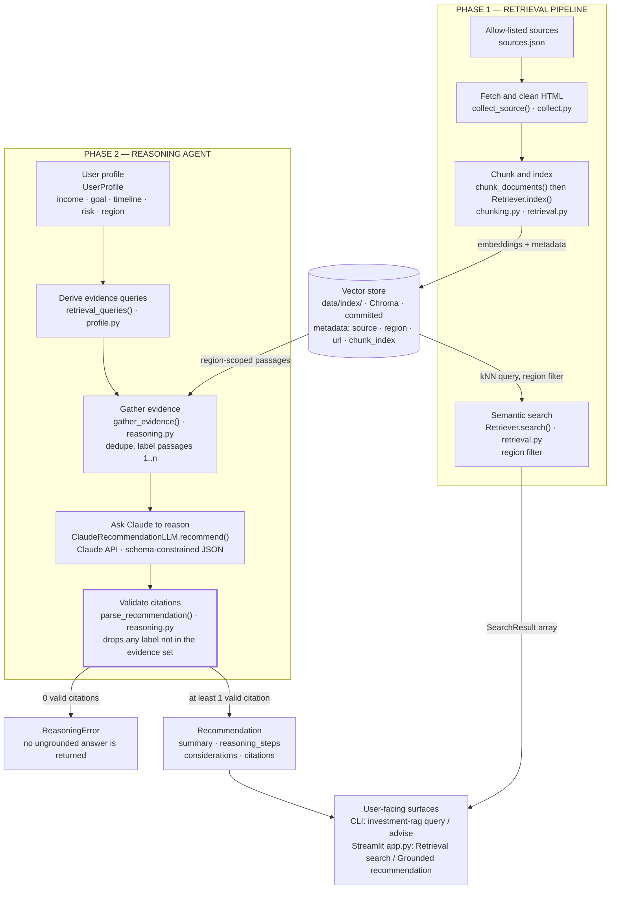

# Architecture

How Phase 1 (retrieval) and Phase 2 (reasoning) fit together: two phases sharing
one evidence trail. Phase 1 turns official EU/UK sources into a searchable,
provenance-tagged vector store. Phase 2 adds a reasoning agent that queries that
same store on a user's behalf and asks Claude for a recommendation — but only
returns it once every claim resolves back to a real, retrieved passage.

> Educational only, not regulated financial advice. This diagram reflects the
> code in [`src/investment_rag/`](../investment_rag/) and [`app.py`](../../app.py)
> as of Phase 2.

An interactive version of this diagram is published as an Artifact at
<https://claude.ai/code/artifact/dc91dada-5ff5-417c-ad3e-2d1433ff9545>; this
document is the canonical, version-controlled copy.

## System diagram

## How to read it

**Both phases share one retrieval mechanism.** Phase 1's `Retriever.search()` is
called directly for plain queries, and again internally by Phase 2's
`gather_evidence()` — every call locked to the user's `region`, so a UK profile
never sees EU-only passages or vice versa.

**The `Validate citations` step is the trust boundary** (thick border above). It
re-checks Claude's citation labels against the passages actually retrieved and
discards anything invented, raising `ReasoningError` instead of surfacing an
ungrounded answer. This is what backs the project's low-hallucination goal:
a recommendation cannot reach the user carrying a citation that doesn't resolve
to a real, region-matched source.

## The two request paths

### Retrieval search — Phase 1 only

`investment-rag query` · Streamlit "Retrieval search"

1. The question is embedded (ONNX MiniLM `all-MiniLM-L6-v2`) at query time.
2. `Retriever.search()` runs a cosine kNN against `data/index/`, optionally
   hard-filtered to `region`.
3. Returns `SearchResult` records — each carries source name, region, URL,
   title, and chunk index.

### Grounded recommendation — Phase 1 + Phase 2

`investment-rag advise` · Streamlit "Grounded recommendation"

1. `UserProfile` is validated (`profile.py`) — bad enums or negative amounts are
   rejected before any work happens.
2. `retrieval_queries()` expands the profile into five sub-queries: horizon,
   risk tolerance, fees, goal, and one region-specific query (ISA vs. general
   account for UK, MiFID II protections for EU).
3. `gather_evidence()` runs each through `Retriever.search(region=profile.region)`,
   dedupes by chunk id, and labels the survivors `1, 2, 3, …`.
4. `build_user_prompt()` renders the profile plus the numbered passages;
   `ClaudeRecommendationLLM.recommend()` sends it to Claude with a JSON-schema
   output constraint, so the reply is a structured
   `{summary, reasoning_steps, considerations, citations}` object rather than
   free text.
5. `parse_recommendation()` resolves every citation label against the passages
   actually retrieved. Invented labels are dropped; if none remain, it raises
   `ReasoningError` rather than return an ungrounded answer.
6. On success: a `Recommendation` whose citations each resolve to a real,
   region-matched source, rendered by the CLI or the Streamlit app.

## Module reference

| Module | Phase | Responsibility |
| --- | --- | --- |
| [`models.py`](../investment_rag/models.py) | 1 | `SourceDocument`, `Chunk`, `SearchResult` — the dataclasses every stage passes around. |
| [`collect.py`](../investment_rag/collect.py) | 1 | Downloads allow-listed pages, strips chrome, saves reviewable JSON. Refuses to bypass a `403`. |
| [`chunking.py`](../investment_rag/chunking.py) | 1 | Sentence-boundary chunking with a carried-over overlap, so no passage loses its context mid-sentence. |
| [`retrieval.py`](../investment_rag/retrieval.py) | 1 | ONNX MiniLM embeddings, persistent Chroma storage, and the region-filtered `search()` both phases call. |
| [`profile.py`](../investment_rag/profile.py) | 2 | `UserProfile` plus `retrieval_queries()`, which turns income/goal/timeline/risk/region into five targeted evidence queries. |
| [`reasoning.py`](../investment_rag/reasoning.py) | 2 | Evidence gathering, the Claude call with a JSON-schema output constraint, and the citation-validation gate. |
| [`cli.py`](../investment_rag/cli.py) | both | The `investment-rag` commands: `collect`, `build`, `query` (Phase 1), and `advise` (Phase 2). |
| [`app.py`](../../app.py) | both | Streamlit UI with two modes — retrieval search, and the profile form behind grounded recommendations. |

## What comes next

Phase 3 adds explicit multi-jurisdiction routing on top of the region locking
already enforced here; Phase 4 adds an evaluation harness for groundedness and
hallucination rate. See [project-plan.md](project-plan.md) for the full
phase-by-phase plan and acceptance criteria.
