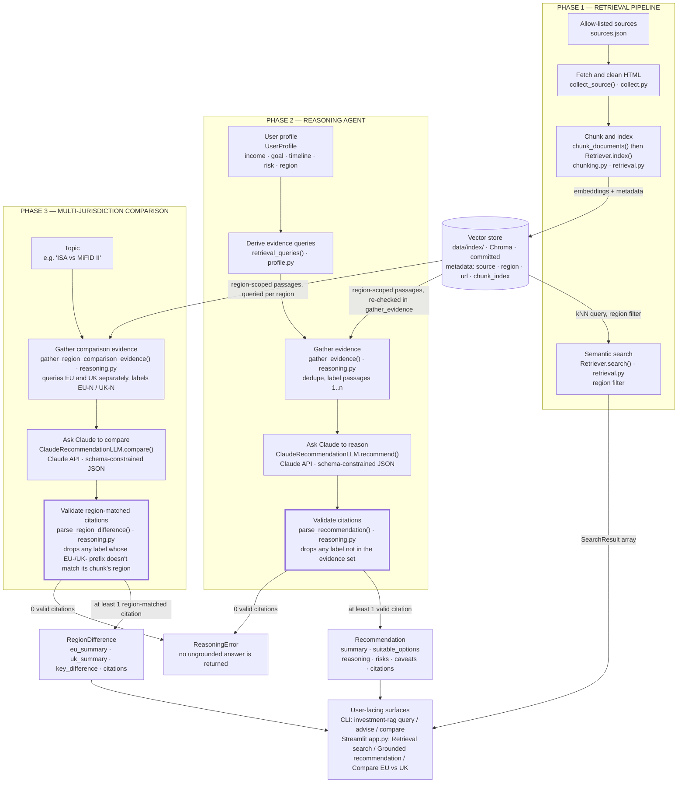

# Architecture

How Phase 1 (retrieval), Phase 2 (reasoning), and Phase 3 (multi-jurisdiction
routing) fit together: three phases sharing one evidence trail. Phase 1 turns
official EU/UK sources into a searchable, provenance-tagged vector store.
Phase 2 adds a reasoning agent that queries that same store on a user's behalf
and asks Claude for a recommendation — but only returns it once every claim
resolves back to a real, retrieved passage. Phase 3 hardens the region
boundary Phase 2 already enforced at the retriever level, and adds a second
request path that explains a jurisdiction difference directly.

> Educational only, not regulated financial advice. This diagram reflects the
> code in [`src/investment_rag/`](../investment_rag/) and [`app.py`](../../app.py)
> as of Phase 3.

An interactive version of this diagram was published as an Artifact at
<https://claude.ai/code/artifact/dc91dada-5ff5-417c-ad3e-2d1433ff9545> as of
Phase 2 and has not been republished for Phase 3; this document is the
canonical, version-controlled copy and is kept current.

## System diagram

```mermaid
flowchart TD
    subgraph P1["PHASE 1 — RETRIEVAL PIPELINE"]
        SRC["Allow-listed sources<br/>sources.json"]
        COL["Fetch and clean HTML<br/>collect_source() · collect.py"]
        CHK["Chunk and index<br/>chunk_documents() then Retriever.index()<br/>chunking.py · retrieval.py"]
        SRCH["Semantic search<br/>Retriever.search() · retrieval.py<br/>region filter"]
        SRC --> COL --> CHK
    end

    STORE[("Vector store<br/>data/index/ · Chroma · committed<br/>metadata: source · region · url · chunk_index")]

    subgraph P2["PHASE 2 — REASONING AGENT"]
        PROF["User profile<br/>UserProfile<br/>income · goal · timeline · risk · region"]
        QRY["Derive evidence queries<br/>retrieval_queries() · profile.py"]
        GATH["Gather evidence<br/>gather_evidence() · reasoning.py<br/>dedupe, label passages 1..n"]
        LLM["Ask Claude to reason<br/>ClaudeRecommendationLLM.recommend()<br/>Claude API · schema-constrained JSON"]
        VAL["Validate citations<br/>parse_recommendation() · reasoning.py<br/>drops any label not in the evidence set"]
        PROF --> QRY --> GATH --> LLM --> VAL
    end

    subgraph P3["PHASE 3 — MULTI-JURISDICTION COMPARISON"]
        TOPIC["Topic<br/>e.g. 'ISA vs MiFID II'"]
        CGATH["Gather comparison evidence<br/>gather_region_comparison_evidence() · reasoning.py<br/>queries EU and UK separately, labels EU-N / UK-N"]
        CLLM["Ask Claude to compare<br/>ClaudeRecommendationLLM.compare()<br/>Claude API · schema-constrained JSON"]
        CVAL["Validate region-matched citations<br/>parse_region_difference() · reasoning.py<br/>drops any label whose EU-/UK- prefix doesn't match its chunk's region"]
        TOPIC --> CGATH --> CLLM --> CVAL
    end

    CHK -- "embeddings + metadata" --> STORE
    STORE -- "kNN query, region filter" --> SRCH
    STORE -- "region-scoped passages, re-checked in gather_evidence" --> GATH
    STORE -- "region-scoped passages, queried per region" --> CGATH

    VAL -- "at least 1 valid citation" --> REC["Recommendation<br/>summary · suitable_options<br/>reasoning · risks · caveats · citations"]
    VAL -- "0 valid citations" --> ERR["ReasoningError<br/>no ungrounded answer is returned"]
    CVAL -- "at least 1 region-matched citation" --> DIFF["RegionDifference<br/>eu_summary · uk_summary · key_difference · citations"]
    CVAL -- "0 valid citations" --> ERR

    SRCH -- "SearchResult array" --> UI["User-facing surfaces<br/>CLI: investment-rag query / advise / compare<br/>Streamlit app.py: Retrieval search / Grounded recommendation / Compare EU vs UK"]
    REC --> UI
    DIFF --> UI

    classDef gate stroke-width:3px
    class VAL,CVAL gate
```

## How to read it

**All three phases share one retrieval mechanism.** Phase 1's `Retriever.search()`
is called directly for plain queries, and again internally by Phase 2's
`gather_evidence()` and Phase 3's `gather_region_comparison_evidence()` — every
call locked to a region, so a UK profile never sees EU-only passages or vice
versa. Phase 3 goes one step further: `gather_evidence()` no longer trusts the
retriever's `where` filter alone — it re-checks each result's `region` field
itself before keeping it, so a bug in the store can't leak an out-of-region
source into a recommendation.

**The `Validate citations` steps are the trust boundary** (thick border above).
`parse_recommendation()` re-checks Claude's citation labels against the passages
actually retrieved and discards anything invented, raising `ReasoningError`
instead of surfacing an ungrounded answer. Phase 3's `parse_region_difference()`
adds a second check on top: a citation labeled `"EU-N"` or `"UK-N"` is only kept
if that prefix matches the region of the chunk it resolved to, so the model
can't launder an EU claim under a UK-looking label or vice versa. This is what
backs the project's low-hallucination goal: an answer cannot reach the user
carrying a citation that doesn't resolve to a real, region-matched source.

## The two request paths

### Retrieval search — Phase 1 only

`investment-rag query` · Streamlit "Retrieval search"

1. The question is embedded (ONNX MiniLM `all-MiniLM-L6-v2`) at query time.
2. `Retriever.search()` runs a cosine kNN against `data/index/`, optionally
   hard-filtered to `region`.
3. Returns `SearchResult` records — each carries source name, region, URL,
   title, and chunk index.

### Grounded recommendation — Phase 1 + Phase 2

`investment-rag advise` · Streamlit "Grounded recommendation"

1. `UserProfile` is validated (`profile.py`) — bad enums or negative amounts are
   rejected before any work happens.
2. `retrieval_queries()` expands the profile into five sub-queries: horizon,
   risk tolerance, fees, goal, and one region-specific query (ISA vs. general
   account for UK, MiFID II protections for EU).
3. `gather_evidence()` runs each through `Retriever.search(region=profile.region)`,
   dedupes by chunk id, labels the survivors `1, 2, 3, …`, and stops once
   `MAX_EVIDENCE_PASSAGES` (10) unique passages are collected, so prompt size
   stays bounded regardless of how many sub-queries still have budget left.
4. `build_user_prompt()` renders the profile — explicitly framed as synthetic
   demo data — plus the numbered passages (each truncated to
   `MAX_PASSAGE_CHARS`), and asks for suitability reasoning across vehicle
   *types* rather than a single pick or an amount to invest.
   `ClaudeRecommendationLLM.recommend()` sends it to Claude (`claude-sonnet-5`
   by default, chosen for latency over `claude-opus-5`) with a JSON-schema
   output constraint, so the reply is a structured
   `{summary, suitable_options, reasoning, risks, caveats, citations}` object
   rather than free text. Framing the task as education over synthetic profiles
   is what keeps Claude from softening or declining the response the way it does
   when asked for direct, personalized investment instructions. The system
   prompt also caps each array (at most 4 suitable options, 5 reasoning steps,
   5 risks, 5 caveats, 8 citations); Anthropic's `json_schema` format doesn't
   support `maxItems`, so `parse_recommendation()` re-enforces the same caps by
   slicing the payload.
5. `parse_recommendation()` resolves every citation label against the passages
   actually retrieved. Invented labels are dropped; if none remain, it raises
   `ReasoningError` rather than return an ungrounded answer.
6. On success: a `Recommendation` whose citations each resolve to a real,
   region-matched source, rendered by the CLI or the Streamlit app.

### Compare EU vs UK — Phase 1 + Phase 3

`investment-rag compare <topic>` · Streamlit "Compare EU vs UK"

1. `gather_region_comparison_evidence()` runs the topic through
   `Retriever.search()` once per region, labeling survivors `"EU-1"`, `"EU-2"`,
   …, `"UK-1"`, `"UK-2"`, … by the region they were retrieved under, so the
   provenance of each passage is legible in the prompt itself.
2. `build_region_difference_prompt()` renders the topic plus both regions'
   passages and asks for what generally applies in each region and the single
   most important difference between them — never a product, an amount, or an
   instruction to act, framed the same way as Phase 2.
   `ClaudeRecommendationLLM.compare()` sends it to Claude with a JSON-schema
   output constraint for a `{eu_summary, uk_summary, key_difference, citations}`
   object.
3. `parse_region_difference()` resolves every citation label against the
   passages actually retrieved, same as Phase 2, and additionally rejects any
   citation whose `"EU-"` / `"UK-"` label prefix doesn't match the region of the
   chunk it resolved to. If nothing survives, it raises `ReasoningError`.
4. On success: a `RegionDifference` whose EU and UK claims each carry citations
   that are traceably drawn from that region's own sources.

## Module reference

| Module | Phase | Responsibility |
| --- | --- | --- |
| [`models.py`](../investment_rag/models.py) | 1 | `SourceDocument`, `Chunk`, `SearchResult` — the dataclasses every stage passes around. |
| [`collect.py`](../investment_rag/collect.py) | 1 | Downloads allow-listed pages, strips chrome, saves reviewable JSON. Refuses to bypass a `403`. |
| [`chunking.py`](../investment_rag/chunking.py) | 1 | Sentence-boundary chunking with a carried-over overlap, so no passage loses its context mid-sentence. |
| [`retrieval.py`](../investment_rag/retrieval.py) | 1 | ONNX MiniLM embeddings, persistent Chroma storage, and the region-filtered `search()` both phases call. |
| [`profile.py`](../investment_rag/profile.py) | 2 | `UserProfile` plus `retrieval_queries()`, which turns income/goal/timeline/risk/region into five targeted evidence queries. |
| [`reasoning.py`](../investment_rag/reasoning.py) | 2, 3 | Evidence gathering (with a region-leak check as of Phase 3), the Claude calls (`recommend()`, `compare()`) with a JSON-schema output constraint, and the citation-validation gates for both request paths. |
| [`cli.py`](../investment_rag/cli.py) | all | The `investment-rag` commands: `collect`, `build`, `query` (Phase 1), `advise` (Phase 2), and `compare` (Phase 3). |
| [`app.py`](../../app.py) | all | Streamlit UI with three modes — retrieval search, the profile form behind grounded recommendations, and the EU vs UK comparison. |

## What comes next

Phase 4 adds an evaluation harness for groundedness and hallucination rate.
See [project-plan.md](project-plan.md) for the full phase-by-phase plan and
acceptance criteria.
